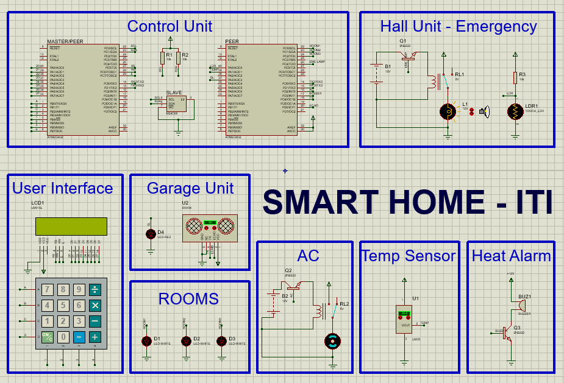

# ITI Smart Home Project



## Features

- **Login System**: Secure login systems are implemented for both administrators and guests.

- **Lighting Control**: Control the lighting in each room of your home remotely.

- **Air Conditioner Temperature Control**: Adjust the temperature of your air conditioner from anywhere.

- **Heat Alarm**: Receive alerts when the temperature in any part of your home exceeds 50 degrees Celsius.

- **Ultrasonic Collision Avoidance**: Utilizes ultrasonic sensors to avoid collisions in the garage.

- **Emergency Lamp**: Provides emergency lighting in the hall unit.

## Components Used

- **Microcontrollers**: 2 x AVR ATmega32.

- **Sensors**: Ultrasonic sensor, LDR with torch, temperature sensor.

- **Actuators**: DC motor (for air conditioner), LEDs, buzzer.

- **Memory**: EEPROM for data storage.

- **User Interface**: Keypad and LCD for user interaction.

## Project Structure

```plaintext
Root/
|-- ITI_Master/
|   |-- Debug/
|   |   |-- iti_master.hex
|   |-- HAL/
|   |   |-- KEYPAD/
|   |   |   |-- KEYPAD.c
|   |   |   |-- KEYPAD.h
|   |   |-- LCD/
|   |   |   |-- LCD.c
|   |   |   |-- LCD.h
|   |   |-- EEPROM/
|   |   |   |-- EEPROM.c
|   |   |   |-- EEPROM.h  
|   |-- MCAL/
|   |   |-- DIO/
|   |   |   |-- DIO.c
|   |   |   |-- DIO.h  
|   |   |-- I2C/
|   |   |   |-- I2C.c
|   |   |   |-- I2C.h  
|   |   |-- UART/
|   |   |   |-- UART.c
|   |   |   |-- UART.h  
|   |-- LIB/
|   |   |-- STD_Types.h
|   |   |-- BIT_Math.h
|   |-- MENU.c
|   |-- MENU.h
|   |-- main.c
|   |-- main.h
|   |-- HELPER.c
|   |-- HELPER.h
|
|-- ITI_Peer/
|   |-- Debug/
|   |   |-- iti_peer.hex
|   |-- MCAL/
|   |   |-- ADC/
|   |   |   |-- ADC.c
|   |   |   |-- ADC.h 
|   |   |-- DIO/
|   |   |   |-- DIO.c
|   |   |   |-- DIO.h  
|   |   |-- INT/
|   |   |   |-- INT.c
|   |   |   |-- INT.h  
|   |   |-- UART/
|   |   |   |-- UART.c
|   |   |   |-- UART.h  
|   |-- LIB/
|   |   |-- STD_Types.h
|   |   |-- BIT_Math.h
|   |-- main.c
|   |-- main.h
|   |-- HELPER.c
|   |-- HELPER.h
|
|-- Simulations/
|   |-- Circuit.png (Screenshot of the circuit diagram)
|   |-- ITI_Smart_Home.pdsprj (Proteus simulation file)
```

## License

This project is licensed under the MIT License. See the [LICENSE](LICENSE) file for details.

## Getting Started

To clone this project, run the following command:

```bash
git clone https://github.com/MennatAllahhxx/Smart_Home_ITI.git
```
## Usage

To effectively use the ITI Smart Home Project, follow these steps:

1. **Navigate to the Appropriate Folder**: Depending on your role and task, navigate to either the "ITI_Master" or "ITI_Peer" folder.

2. **Compile and Flash Code**: Compile the code found in the selected folder and flash it onto your AVR ATmega32 microcontroller. Ensure that you follow the relevant instructions for your role (master or peer).

3. **Proteus Simulation (if needed)**: If simulation is required, use Proteus and open the provided "ITI_Smart_Home.pdsprj" file to run the simulation.

4. **Enjoy Smart Home Control**: Once set up, you can enjoy controlling various aspects of your smart home.

**Note:** This project was created using Proteus 8.10, and the simulation files may not work on older versions of Proteus.

## Contributors

This project has been contributed to by:

- Menna Hassan [GitHub](https://github.com/MennatAllahhxx) | [LinkedIn](https://linkedin.com/in/MennatAllahhxx)
- Mohamed Raafat
- Muhammad Ibrahim [GitHub](https://github.com/Muhammadibra40) | [LinkedIn](https://linkedin.com/in/muhammad-ibrahim-093293218)
- Nouran Ahmed [LinkedIn](https://www.linkedin.com/in/nouran-darwish-245a85203)
- Ziad Bahaa

We welcome contributions from the community, including bug reports, feature requests, and pull requests. Feel free to get involved and help improve the project!

## Acknowledgments

Special thanks to Information Technology Institution for their invaluable support and guidance throughout the development of this project. Their expertise has been instrumental in making this Smart Home Project a reality.
